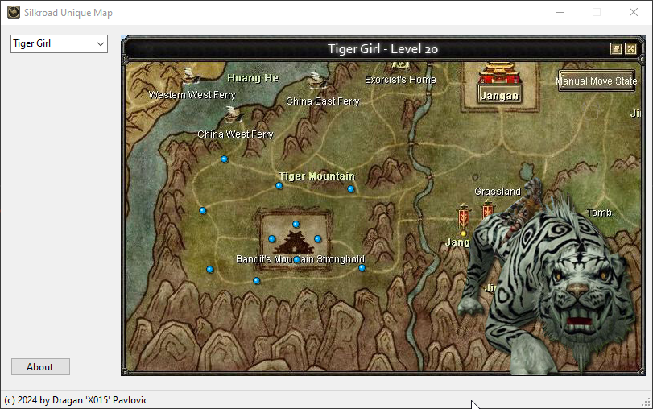

# Silkroad Unique Map

## My First Visual Basic .NET Project 🎉

Welcome to my first GitHub project! This is a simple Visual Basic .NET application where the selected item in a ComboBox determines which PictureBox is displayed. 

## Features
- A ComboBox with various options.
- Dynamically updates the visibility of PictureBoxes based on the selection.

## Why This Project?
This project is my first step in learning Visual Basic .NET and improving my programming skills. 🚀  

## How It Works
1. Select an option from the ComboBox.
2. The corresponding PictureBox will appear, while others remain hidden.

## Technologies Used
- Visual Basic .NET
- Windows Forms

## Feedback
Since this is my first project, I'd love to hear your thoughts! Feel free to open an issue or suggest improvements.

---

Thank you for visiting! 😊
